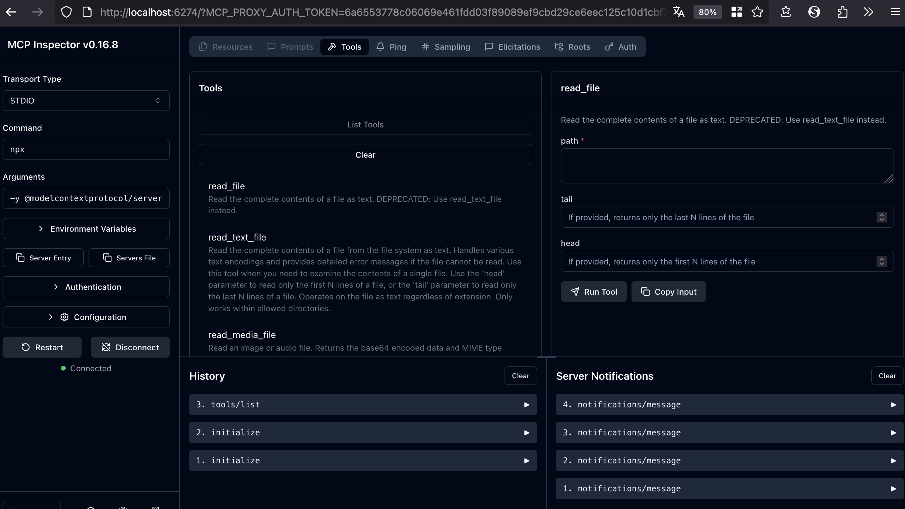

# The MCP inspector is a developer tool for testing and debugging*
https://github.com/modelcontextprotocol/inspector

1. with command `npx @modelcontextprotocol/inspector`

2. provide settings as in running mcp server:
```
{
    "mcpServers": {
        "filesystem": {
            "command": "npx",
            "args": [
                "-y",
                "@modelcontextprotocol/server-filesystem",
                "/Users/bruno/work/projects/java/spring-ai/mcp"
            ]
        }
    }
}
```

3. use command and arguments

4. click "Connect"
5. check tools list

